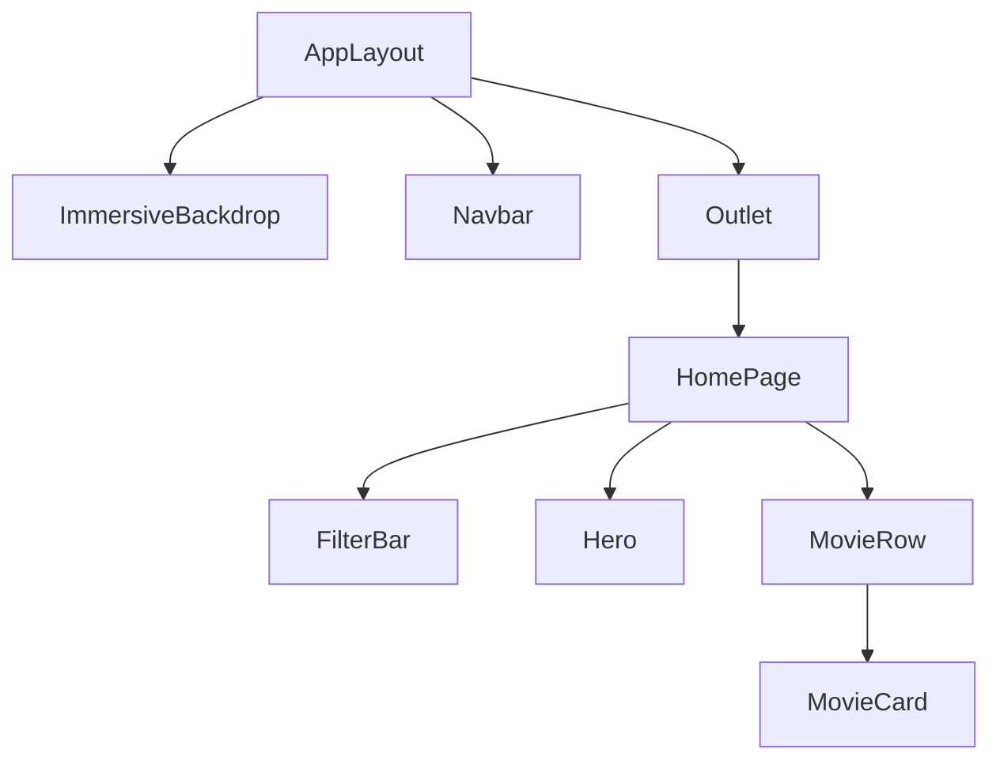

# Technical Design: movixy-premium-ux-refactor

## Component Architecture

## Patterns and Hooks
* **`useSpatialNavigation`**: A new hook that will centralize the `focusedId` state. It will use `element.getBoundingClientRect()` to calculate the nearest neighbor in the direction of the pressed arrow key.
* **`useBackdrop`**: Hook that subscribes to the focus state and updates the global background image URL.

## File Changes
* `src/presentation/layouts/AppLayout.tsx`: Inject the `ImmersiveBackdrop`.
* `src/application/services/media-playback.service.ts`: New content resolution logic.
* `src/presentation/hooks/useSpatialNavigation.ts`: Replacement for `useDpadNavigation`.
